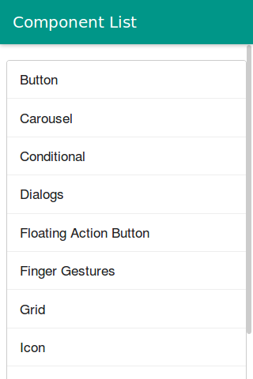

# OnsenUI2JS-demo

This is a simple demo app for using [OnsenUI 2](https://github.com/OnsenUI/OnsenUI) npm module in Meteor.js

## Is this for me?
If you like use [OnsenUI 2](https://github.com/OnsenUI/OnsenUI) npm module in Meteor framework then this project can useful for you. I try to use OnsenUI 2 with **Blaze** in a right way in Meteor 1.3.2.4 that has new official npm integration.

## Quick Start
First install latest version of Meteor with below command:

     curl https://install.meteor.com/ | sh 

Then create a project and install OnsenUI 2 with below command:

    meteor npm install onsenui --save
    
## Contribute
I need your help to improve this project. If you want to patch a bug or add some feature: create a [pull request]()